---

## 9. Desarrollo y Evidencias

### 9.1. Datos para revisión

Para el cumplimiento de esta práctica, se ha generado un dataset de **1000 productos** mediante un script de carga masiva en el contenedor de PostgreSQL. Las características del dataset son:

* **Usuarios**: Se cuenta con un total de **5 usuarios** creados con correos institucionales (@est.ups.edu.ec).
* **Categorías**: Cada producto está asociado a **al menos 2 categorías** para validar las relaciones `@ManyToMany`.
* **Precios**: Los productos cuentan con precios variados en un rango de **$10 a $5000**.
* **Nombres**: Se han asignado nombres con **texto buscable** (ej. "Laptop", "Monitor", "Headset") para probar los filtros dinámicos.

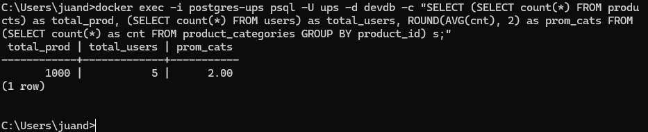

### 9.2. Evidencias de funcionamiento

Se presentan las capturas de pantalla de las pruebas realizadas en Postman para validar la lógica de paginación:

* **Page response (`GET /api/products/paginated?page=0&size=5`)**:
* Muestra el contenido de la página junto con los metadatos completos: `totalElements` (1000), `totalPages` (200), `number` (página actual) y `size`.

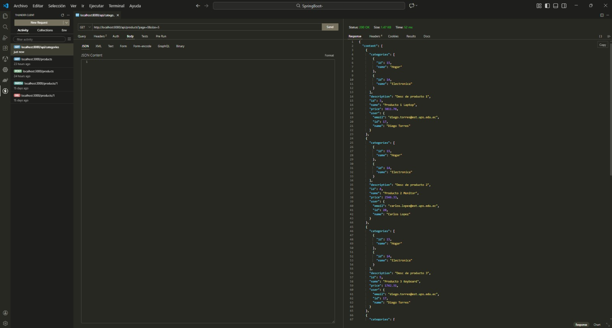
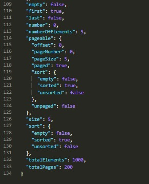

* **Slice response (`GET /api/products/slice?page=0&size=5`)**:
* Muestra la respuesta de paginación ligera. Se evidencia que **no incluye** `totalElements` ni `totalPages`, optimizando la consulta al evitar el conteo total en la base de datos.

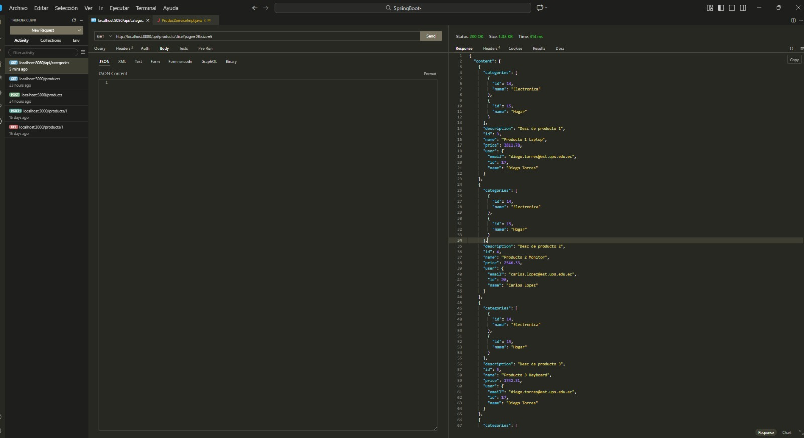
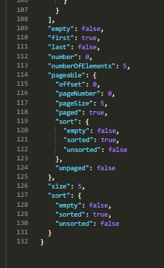

* **Filtros + paginación (`GET /api/products/search?name=laptop&page=0&size=3`)**:
* Respuesta filtrada que cumple con el criterio de búsqueda por nombre y respeta el tamaño de página solicitado (`size=3`).

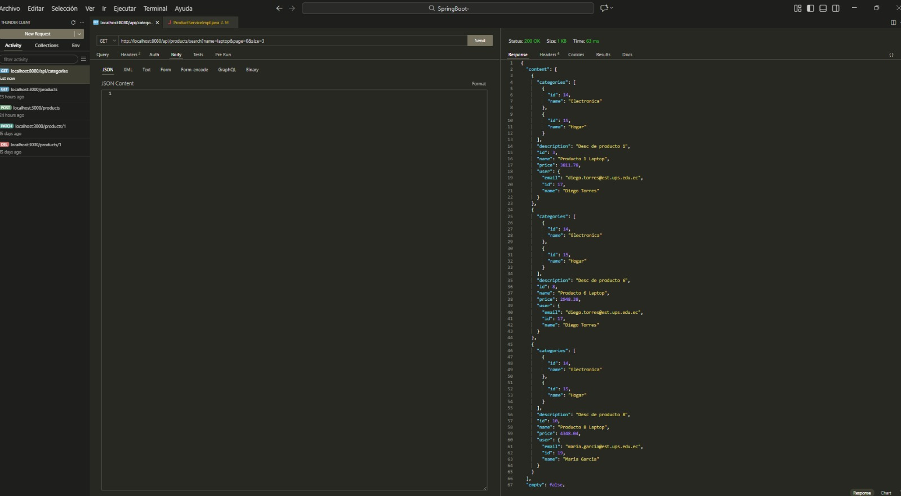
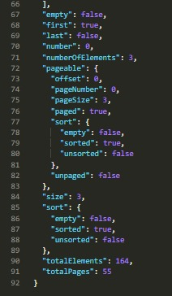

* **Ordenamiento (`GET /api/products?sort=price,desc&page=1&size=5`)**:
* Captura que muestra el contenido de la segunda página (`number: 1`) con los productos ordenados por precio de forma descendente.

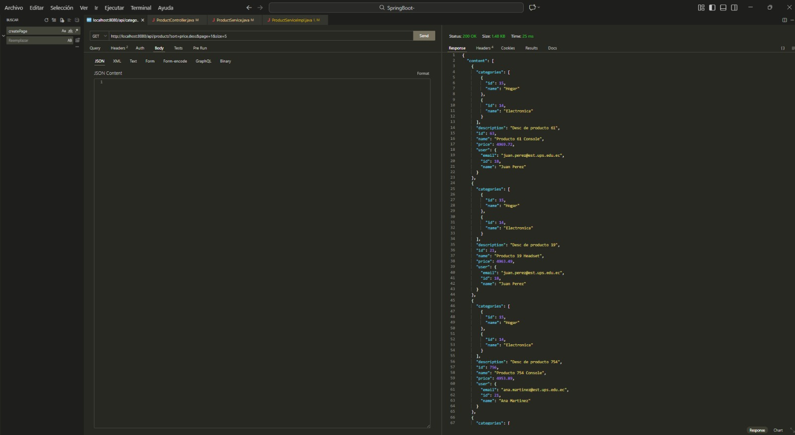
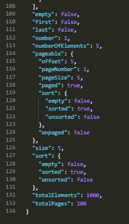

### 9.3. Evidencias de performance

Análisis comparativo de rendimiento entre los diferentes tipos de paginación y escenarios de consulta:

* **Comparación Page vs Slice**: Se registran los tiempos de respuesta de ambos endpoints. Generalmente, `Slice` presenta un menor tiempo al omitir la consulta `SELECT COUNT(*)` generada por Hibernate.

* **Consultas de prueba con volumen**:
* **Primera página (`page=0`, `size=10`)**: Tiempo de respuesta base para Page y Slice.
* **Página intermedia (`page=5`, `size=10`)**: Estabilidad del rendimiento en rangos medios.
* **Últimas páginas**: Análisis del impacto del `OFFSET` elevado (ej. página 190), donde el tiempo de respuesta aumenta debido a que la base de datos debe escanear y saltar registros previos.
* **Búsquedas y Ordenamiento**: Evaluación del rendimiento al aplicar filtros dinámicos (`ILIKE`) y ordenamientos por diferentes campos, verificando la eficiencia de las cláusulas `LIMIT` y `OFFSET` en los logs de SQL.

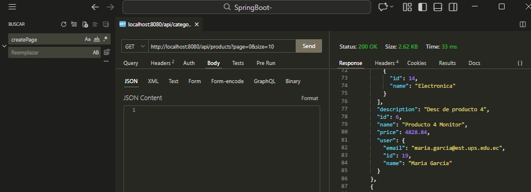
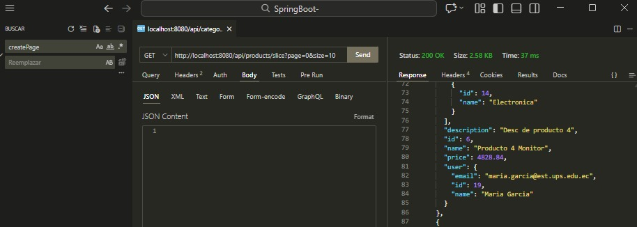
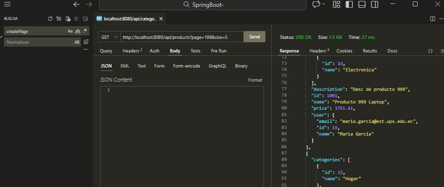
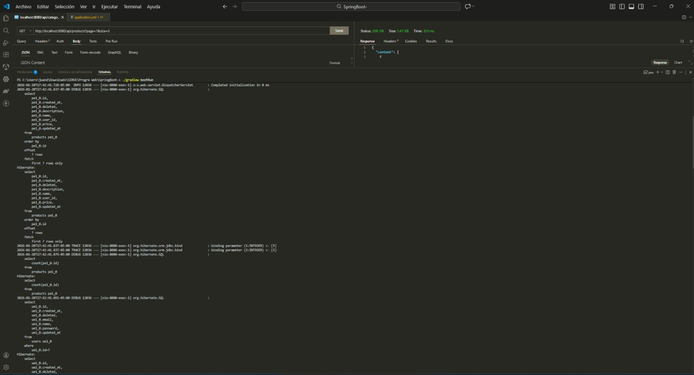

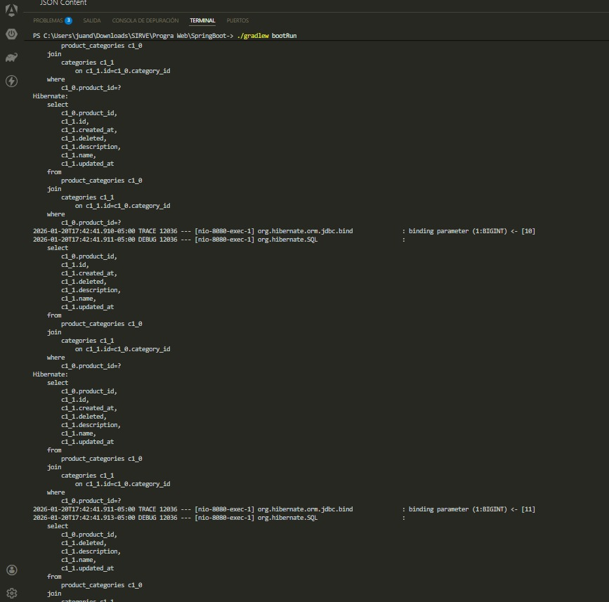
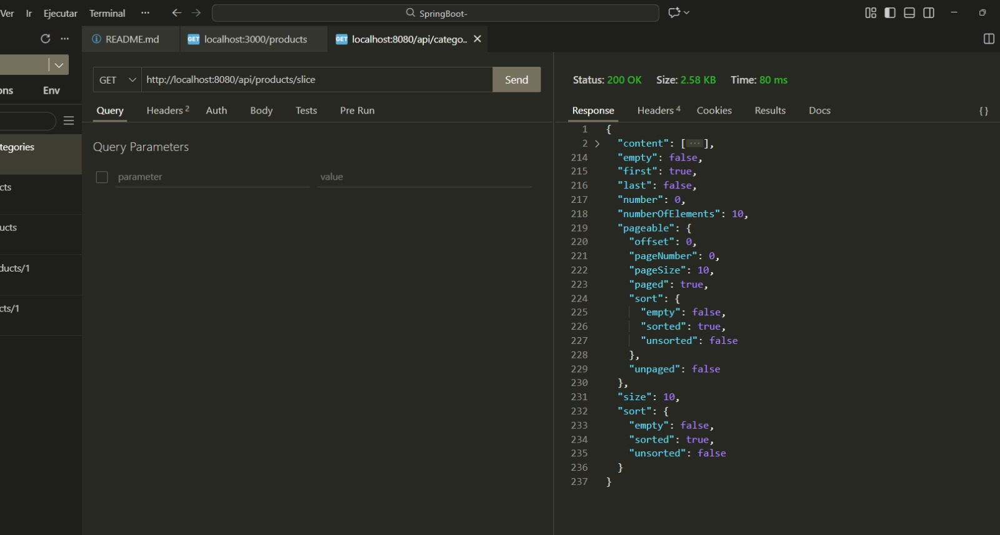
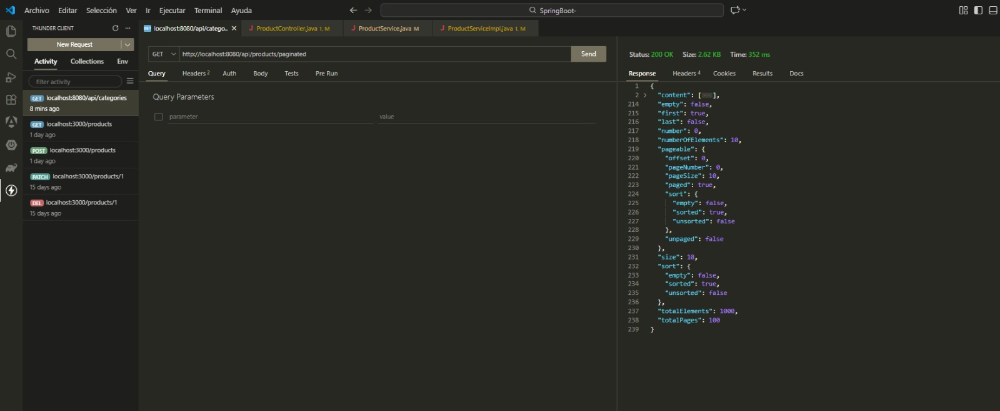